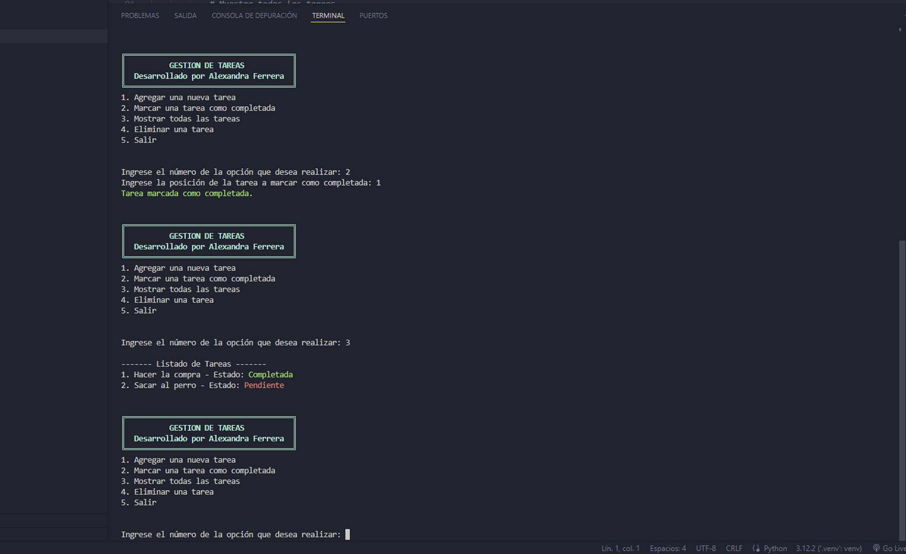

# Gestor de Tareas 

Es un programa que gestiona tareas y que he desarrollado como trabajo para un curso de IBM (Python Fullstack).

El trabajo tiene el siguiente enunciado:

Escribe un programa en Python utilizando Programación Orientada a Objetos que gestione una lista de tareas pendientes. El programa deberá permitir al usuario realizar las siguientes operaciones:

   - Agregar una nueva tarea: El programa deberá permitir al usuario agregar una nueva tarea a la lista de tareas pendientes.
   - Marcar una tarea como completada: El programa deberá permitir al usuario marcar una tarea como completada, dada su posición en la lista.
   - Mostrar todas las tareas: El programa deberá imprimir en pantalla todas las tareas pendientes, numeradas y mostrando su estado (completada o pendiente).
   - Eliminar una tarea: El programa deberá permitir al usuario eliminar una tarea de la lista, dada su posición.
   - 
El programa deberá incluir las siguientes características:

- Manejo de excepciones: El programa deberá manejar excepciones en caso de que el usuario ingrese una opción no válida o una posición que no exista en la lista.
- Comentarios explicativos: El código deberá estar comentado para explicar su funcionamiento en cada parte relevante.

## Captura de Pantalla

## Ver ejemplo en vivo

## Tecnologías Utilizadas

- Python

## Contacto

Para cualquier pregunta o comentario, no dudes en contactarme:

- Nombre: Alexandra Ferrera Arenas
- Perfil de Linkedin: https://www.linkedin.com/in/alexandra-ferrera-arenas/
- Correo Electrónico: sandraferreraarenas@gmail.com
